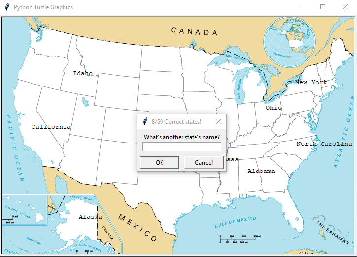

# U.S. States Game

This is a simple game where you have to guess the names of various U.S. states. The game presents you with a blank map of the United States, and you have to input the names of the states. If you guess correctly, the program will fill in the state on the map. The objective is to guess all the states correctly.

## Getting Started

### Prerequisites

- Python 3 installed on your system
- Pandas library installed (`pip install pandas`)
- Turtle graphics library (usually included in Python standard library)
- 
### Installing

1. Clone the repository to your local machine:
   ```sh
   git clone https://github.com/your_username/us-states-game.git

2. Navigate to the project directory: 
    ```sh
   us-states-game 
   Make sure you have the necessary CSV file (50_states.csv) containing the state data.
   
3. Run the game: 
    ```sh
   python us_states_game.py
   
### How to Play
- The game will display a blank map of the United States.
  - You'll be prompted to guess the names of the states.
  - Type in the name of a state and press Enter.
  - If your guess is correct, the state will be filled in on the map.
  - Continue guessing until you've filled in all the states or exit the game.

### Controls 
 - Type the name of the state and press Enter to guess.
 - To exit the game, type "Exit" and press Enter.

### Features

- Guessing States: Input the names of states to fill them in on the map.
- Score: Keep track of how many states you've guessed correctly.
- Exit: You can exit the game at any time by typing "Exit".


### Screenshots

<p align="center">
  
</p>


### Acknowledgments
    
- Inspired by the idea of learning U.S. states through a simple guessing game.
- Uses Turtle graphics library for Python to create the map interface.
- Pandas library is utilized to manage the state data efficiently.